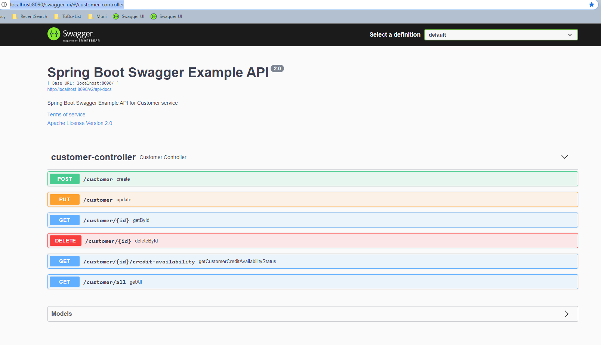

# Customer Microservice

## How to start the service and database

First you need to build the app via Maven, then:

```bash
docker-compose up
```

## Stop & remove the containers

```bash
docker-compose down
```

## swagger-ui

http://localhost:8090/swagger-ui/#/customer-controller

